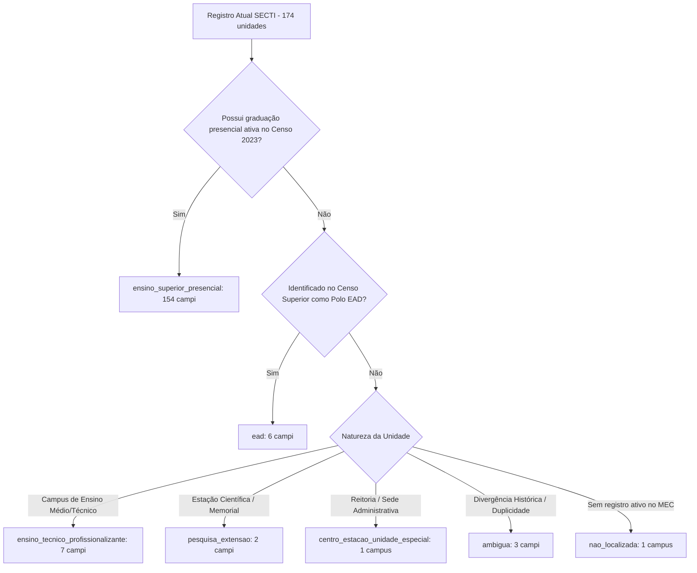

# 🏛️ Relatório de Reconciliação Semântica Definitiva: Campi SECTI × INEP

**Etapa:** 2.3 — Reconciliação Semântica e Decisão de Migração  
**Data da Auditoria:** 16/09/2026, 10:51:01  
**Fontes Oficiais:** INEP Censo da Educação Superior 2023 & Catálogo de Ativos SECTI (`lista_ativos_cti`)

---

## 1. Resumo Numérico Executivo

| Métrica | Quantidade | Descrição Conceitual |
| :--- | :---: | :--- |
| **Total Campi SECTI Auditados** | **174** | Registros de campi na base atual em produção. |
| **Total Unidades Presenciais INEP** | **219** | Presenças físicas com graduação presencial ativa no Censo 2023. |
| **Matches Confirmados (Presencial)** | **154** | Campi com oferta presencial de ensino superior ativa confirmada. |
| **Novas Unidades Presenciais INEP** | **59** | Registros presenciais do Censo 2023 não contemplados na SECTI original. |
| **SECTI Somente EAD** | **6** | Campi que no Censo Superior operam estritamente via polo a distância. |
| **SECTI Ensino Técnico/Profissional** | **7** | Campi de IFBA/IF Baiano sem graduação (foco em ensino médio técnico). |
| **SECTI Pesquisa / Especial** | **3** | Estações científicas, memoriais e sedes administrativas executivas. |
| **SECTI Ambíguos** | **3** | Divergências históricas de denominação ou duplicidades cadastrais. |
| **SECTI Não Localizados** | **1** | Registros inativos ou descontinuados sem turmas em 2023. |

> **Validação de Consistência SECTI:**  
> $\text{Matches} (154) + \text{Técnico} (7) + \text{Pesquisa/Especial} (3) + \text{EAD} (6) + \text{Ambíguos} (3) + \text{Não Loc.} (1) = \mathbf{174}$ ✅

---

## 2. Validação Tipológica dos 219 Registros Presenciais do INEP

As 219 presenças físicas do INEP decorrem **exclusivamente de cursos de graduação presenciais regulares**:

$$\text{Sede Presencial} (145) + \text{Campus Presencial} (70) + \text{Unidade Presencial} (4) = \mathbf{219} \quad (\text{Outro} = 0) \quad \text{✅}$$

- **Sede Presencial (145):** Reitoria / Matriz administrativa cadastrada no MEC com turmas presenciais no município.
- **Campus Presencial (70):** Campus descentralizado fora de sede de Universidade pública ou Instituto Federal.
- **Unidade Presencial (4):** Unidade física acadêmica de faculdade isolada em município distinto da sede.
- **Polos EAD Isolados (36.358 ofertas):** Totalmente segregados e **excluídos** da contagem de infraestrutura física.

---

## 3. Tabela de Decisão Semântica

---

## 4. Reconciliação dos 27 Registros SECTI Originalmente Não Encontrados

Dos 27 registros que divergiram na primeira varredura por igualdade simples de texto:
- **10 Campi do IF Baiano** possuíam cursos superiores presenciais ativos (Bom Jesus da Lapa, Catu, Guanambi, Itapetinga, Santa Inês, Senhor do Bonfim, Serrinha, Teixeira de Freitas, Uruçuca, Valença), mas divergiam devido ao espaço na sigla (`IF BAIANO` vs `IFBAIANO`).
- **6 Faculdades Privadas** de Salvador e Vitória da Conquista (UniFTC, Diplomata, UNIRB Salvador, Anhanguera Salvador, UNINASSAU Conquista, Anhanguera Conquista) possuíam graduação presencial ativa com códigos IES oficiais consolidados.
- **7 Campi dos Institutos Federais** são genuinamente voltados à educação técnica e profissionalizante de nível médio (Alagoinhas, Campo Formoso, Gov. Mangabeira, Itaberaba, Jaguaquara, Ubaitaba, Xique-Xique).
- **2 Unidades da UNEB** são centros especializados de pesquisa e patrimônio (Memorial e Centro de Estudos de Canudos; Museu de Arqueologia de Jeremoabo).
- **1 Unidade é a Reitoria Administrativa** do IF Baiano em Salvador (órgão central).
- **1 Unidade é duplicidade institucional** da UFSB em Itabuna (Campus Jorge Amado).

### Detalhamento das 11 Unidades Técnicas e de Pesquisa Preservadas:

| ID | Sigla | Nome do Ativo SECTI | Município | Classificação Semântica | Justificativa Técnica |
| :---: | :--- | :--- | :--- | :--- | :--- |
| 5 | IF BAIANO | Instituto Federal de Educação, Ciência e Tecnologia Baiano - Campus Alagoinhas | Alagoinhas | `ensino_tecnico_profissionalizante` | Campus Alagoinhas do IF Baiano atua com ensino médio técnico integrado e subsequente (Agropecuária, Agroindústria). Ausente do Censo da Educação Superior por não ofertar graduação. |
| 27 | IFBA | Instituto Federal de Educação, Ciência e Tecnologia da Bahia - Campus Campo Formoso | Campo Formoso | `ensino_tecnico_profissionalizante` | Campus Campo Formoso do IFBA atua exclusivamente com cursos técnicos (Manutenção em Informática, etc.). Sem graduação ativa em 2023. |
| 58 | IF BAIANO | Instituto Federal de Educação, Ciência e Tecnologia Baiano - Campus Governador Mangabeira | Governador Mangabeira | `ensino_tecnico_profissionalizante` | Campus Governador Mangabeira do IF Baiano atua exclusivamente com cursos técnicos de nível médio (Agropecuária, Informática). |
| 71 | IF BAIANO | Instituto Federal de Educação, Ciência e Tecnologia Baiano - Campus Itaberaba | Itaberaba | `ensino_tecnico_profissionalizante` | Campus Itaberaba do IF Baiano atua com formação profissionalizante e técnica de nível médio. Sem graduação no Censo 2023. |
| 83 | IFBA | Instituto Federal de Educação, Ciência e Tecnologia da Bahia - Campus Jaguaquara | Jaguaquara | `ensino_tecnico_profissionalizante` | Campus Jaguaquara do IFBA vocacionado à educação profissional e técnica de nível médio. Sem cursos de graduação registrados no Censo 2023. |
| 174 | IFBA | Instituto Federal de Educação, Ciência e Tecnologia da Bahia - Campus Avançado Ubaitaba | Ubaitaba | `ensino_tecnico_profissionalizante` | Campus Avançado Ubaitaba do IFBA é uma unidade de formação técnica sem turmas de ensino superior cadastradas no Censo 2023. |
| 188 | IF BAIANO | Instituto Federal de Educação, Ciência e Tecnologia Baiano - Campus Xique-Xique | Xique-Xique | `ensino_tecnico_profissionalizante` | Campus Xique-Xique do IF Baiano focado em formação técnica agropecuária e meio ambiente. Não possui turmas de graduação no Censo 2023. |
| 28 | UNEB | Universidade do Estado da Bahia - Campus Canudos | Canudos | `pesquisa_extensao` | Campus Avançado de Canudos abriga o Centro de Estudos Euclides da Cunha (CEEC) e o Parque Estadual de Canudos, atuando em pesquisa histórica/ambiental e extensão, com oferta acadêmica formal limitada a EAD. |
| 88 | UNEB | Universidade do Estado da Bahia - Campus Jeremoabo | Jeremoabo | `pesquisa_extensao` | Unidade temática da UNEB em Jeremoabo que abriga o Museu de Arqueologia e Paleontologia (MAP) e centro de pesquisa ecológica. Não opera como campus de graduação regular. |
| 132 | IF BAIANO | Instituto Federal de Educação, Ciência e Tecnologia Baiano | Salvador | `centro_estacao_unidade_especial` | Sede Administrativa e Reitoria Geral do IF Baiano (Rua do Rouxinol, Imbuí, Salvador). Estrutura executiva central, sem atividades diretas de ensino/graduação no local. |

---

## 5. Casos Ambíguos (3) e Não Localizados (1)

| ID | Sigla | Nome do Ativo SECTI | Município | Classificação | Evidência & Diagnóstico Institucional |
| :---: | :--- | :--- | :--- | :--- | :--- |
| 19 | UNIAENE | Centro Universitário Adventista de Ensino do Nordeste | Cachoeira | `ambigua` | Divergência histórica de denominação institucional: SECTI adota denominação acadêmica UNIAENE, enquanto MEC/INEP registra como FADBA (IES 4531). |
| 1 | UNIRB | Centro Universitário UNIRB - Alagoinhas | Alagoinhas | `ambigua` | Divergência de sigla no cadastro MEC/INEP ("CENTRO UNI" vs "UNIRB"). Unidade presencial ativa correspondente à IES 3864. |
| 76 | UFSB | Universidade Federal do Sul do Bahia - Campus Jorge Amado | Itabuna | `ambigua` | Duplicidade de registro na base SECTI com o ID 75 (Reitoria e Campus Jorge Amado em Itabuna). Mesma sede física com desdobramento institucional. |
| 164 | UNIRB | FACULDADE UNIRB - SERRINHA | Serrinha | `nao_localizada` | Faculdade UNIRB em Serrinha sem registro de turmas ou cursos ativos no Censo da Educação Superior 2023 (unidade descontinuada ou desativada). |

---

## 6. Campi SECTI com Atuação Somente EAD (6)

| ID | Sigla | Nome do Ativo SECTI | Município | Evidência Censo 2023 |
| :---: | :--- | :--- | :--- | :--- |
| 23 | UNIRB | FACULDADE UNIRB - CAMAÇARI | Camaçari | A UNIRB em Camaçari encerrou atividades presenciais e opera no município estritamente como polo de apoio a distância (10 cursos EAD ativos no Censo 2023). |
| 38 | IFBA | Instituto Federal de Educação, Ciência e Tecnologia da Bahia - Campus Euclides da Cunha | Euclides da Cunha | Campus Euclides da Cunha do IFBA figura no Censo Superior 2023 exclusivamente como polo de ensino a distância. |
| 64 | IFBA | Instituto Federal de Educação, Ciência e Tecnologia da Bahia - Campus Ilhéus | Ilhéus | Campus Ilhéus do IFBA atua com cursos técnicos locais e oferta superior formalizada no Censo 2023 apenas na modalidade a distância. |
| 92 | IFBA | Instituto Federal de Educação, Ciência e Tecnologia da Bahia - Campus Juazeiro | Juazeiro | Campus Juazeiro do IFBA figura no Censo Superior 2023 estritamente com oferta a distância. |
| 112 | UNIDOMPEDRO | Faculdade Dom Pedro II AFYA | Ribeira do Pombal | Faculdade Dom Pedro II AFYA em Ribeira do Pombal atua estritamente como polo de ensino a distância (sem instalações permanentes de graduação presencial). |
| 158 | IFBA | Instituto Federal de Educação, Ciência e Tecnologia da Bahia - Campus Seabra | Seabra | Campus Seabra do IFBA figura no Censo Superior 2023 exclusivamente com oferta a distância. |

---

## 7. Análise dos 59 Novos Registros Presenciais do INEP

| Classificação Semântica | Quantidade | Descrição |
| :--- | :---: | :--- |
| **`possivel_duplicidade`** | **16** | Registros correspondentes a campi SECTI reconciliados (10 IF Baiano + 6 faculdades privadas). |
| **`sede_da_ies`** | **22** | Sedes de novas faculdades privadas credenciadas com graduação ativa no município. |
| **`unidade_presencial`** | **16** | Unidades acadêmicas presenciais ou faculdades privadas no interior. |
| **`nova_unidade_superior`** | **5** | Campi descentralizados de Centros Universitários em polos regionais (LEM, Barreiras, Jequié, Brumado). |
| **Total** | **59** | |

---

## 8. Recomendação Técnica de Migração

> 🔴 **Decisão Estratégica:** `pode_migrar_automatically: false`  
> 
> **Por que NÃO migrar automaticamente?**  
> 1. **Preservação de Escopo:** O Censo do Ensino Superior não contempla o ensino técnico profissionalizante (IFBA/IF Baiano) nem estações avançadas de pesquisa (Canudos/Jeremoabo). Excluí-los da SECTI apagaria 10 polos de ciência e tecnologia de relevância regional.  
> 2. **Segregação de EAD:** Polos EAD não possuem infraestrutura equivalente a campi presenciais e não devem ser plotados na camada física.  
> 3. **Curadoria dos 59 Novos:** As 43 novas presenças físicas identificadas pelo INEP devem passar por validação institucional da equipe SECTI antes de compor a cartografia oficial do Estado da Bahia.
